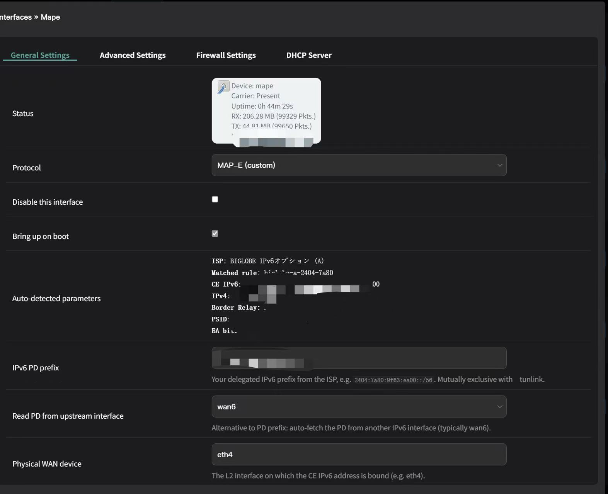

<sub>**English** · [简体中文](README.zh-CN.md) · [日本語](README.md)</sub>

# openwrt-mape-arm64

A MAP-E (RFC 7597) client implementation for arm64 OpenWrt / QWrt routers,
written entirely in shell + awk + iptables. Replaces the non-working
MAP-E built into QSDK-derived firmware.

## Background

Major Japanese ISPs — BIGLOBE IPv6オプション, JPNE v6plus, OCN バーチャル
コネクト and others — deliver service over NTT FLET'S 光 IPv6 IPoE, with
IPv4 carried inside that IPv6 transport using MAP-E. The CE receives an
IPv6 prefix, a shared IPv4 address, and a PSID port range; outbound IPv4
traffic is SNATed into that PSID range and encapsulated in ipip6 to the
ISP's BR.

On mainline OpenWrt and x86 software routers, this works out of the box:
the upstream `map` package and the kernel's nftables flow-offload pipeline
(`nft_flow_offload`) handle it cleanly. The same is true of vendor HGW
boxes from NEC, I-O DATA, etc.

On aarch64 + QSDK firmware (Xiaomi BE7000, BE10000, QWrt, original QSDK
12.5, and similar), MAP-E is effectively broken for three reasons:

1. The built-in MAP-E in QSDK 12.5 (configured via `proto='none'
   type='map-e'`) has bugs — the tunnel often fails to establish, or fw3
   does not recognize the interface.
2. The QSDK kernel (5.4 + QCA proprietary patches) lacks the mainline
   nftables flow-offload pipeline, and the upstream `map` package can't
   be dropped in without modification.
3. The hardware-accelerated MAP-E client module
   (`qca-nss-ppe-tunipip6.ko`) is disabled at compile time in nearly
   every vendor QWrt build.

## What this package does

Replaces the broken built-in MAP-E with a netifd proto handler that
builds the ipip6 tunnel, SNAT, and port forwarding from scratch.

> **Architecture**: developed and tested on aarch64 (IPQ95xx, QWrt 25.12),
> but the package is pure shell + awk + iptables and runs on any
> architecture supported by OpenWrt.

## Why this exists

QSDK / QWrt's built-in MAP-E (`proto='none' type='map-e'` on the wan
interface) has bugs that prevent the tunnel from establishing or fw3
from recognizing it. This package replaces it with a working
implementation that:

- **Auto-detects the ISP** from your IPv6 PD (690 rules from fc2
  calculator covering BIGLOBE / JPNE v6plus / OCN; other ISPs via
  manual mode)
- **Builds the ipip6 tunnel as a proper netifd interface** —
  `ifup mape` / `ifdown mape`, full integration with OpenWrt's
  network stack
- **Generates SNAT rules with conditional probabilities** covering
  100 % of the assigned PSID port range (no leaked ephemeral ports
  that the BR drops)
- **UCI-configured port forwarding** with PSID-range validation
- **LuCI integration** — protocol shows up in Network → Interfaces
  with a configuration form and an "Auto-detected parameters" preview
- **Pure iptables**, no nftables required; compatible with fw3

## Screenshots

LuCI Network → Interfaces — `mape` shows up as a first-class interface
with the protocol `MAP-E (custom)`:


Edit page with auto-detected parameters preview:



## Quick install (one-line, recommended)

ssh into your router as root, then run:

```sh
wget -O - https://github.com/kazehana99k/openwrt-mape-arm64.JP/releases/latest/download/install.sh | sh
```

The installer will:

1. Verify you're on OpenWrt / QWrt
2. `opkg install` the prerequisites (ip-full, iptables, kmod-ip6-tunnel, jsonfilter, …)
3. Download and extract the latest release tarball into `/`
4. Set executable permissions, apply sysctl tuning, reload rpcd
5. Print next steps (restart netifd, configure interface)

Qualcomm PPE kernel modules are not bundled with the portable package. Modules
for Xiaomi BE10000, QWRT 25.12.2, IPQ95xx, Linux 5.4.213, R26.6.16 are
published in the separate
[`qwrt-be10000-mape-ppe` repository](https://github.com/kazehana99k/qwrt-be10000-mape-ppe)
to prevent installation on unrelated firmware.

After installation, run `/etc/init.d/network restart` to register the
new `mape` protocol with netifd, then configure via LuCI or CLI (see
below).

> Prefer to inspect the script first?
> `wget` then `less install.sh` then `sh install.sh`.

## Manual install (from source)

### Prerequisites

```sh
opkg install ip-full iptables iptables-mod-conntrack-extra \
             kmod-ip6-tunnel kmod-iptunnel6 jsonfilter
```

### Deploy

```sh
git clone https://github.com/kazehana99k/openwrt-mape-arm64.JP.git
cd openwrt-mape-arm64.JP

# Push package files into / preserving paths
tar -C package/mape/files -cf - . | ssh root@<router-ip> "cd / && tar -xf -"
tar -C package/luci-app-fleth/root -cf - . | ssh root@<router-ip> "cd / && tar -xf -"
tar -C package/luci-app-fleth/htdocs -cf - . | ssh root@<router-ip> "cd /www && tar -xf -"

# Permissions + reload services
ssh root@<router-ip> '
    chmod +x /lib/netifd/proto/mape.sh \
             /usr/bin/mape-calc \
             /etc/init.d/mape-fw \
             /etc/hotplug.d/iface/40-mape
    sysctl -p /etc/sysctl.d/99-mape.conf
    /etc/init.d/rpcd reload
    /etc/init.d/network restart   # netifd needs restart to register the new proto
'
```

## Configuration

### Option A — LuCI (recommended)

1. Open **Network → Flet'h Configuration**
2. Run **Auto Configure tunnel Interface**
3. Confirm that PD is read from `wan6` and ISP, CE IPv6, mapped IPv4, BR,
   PSID, and WAN device are populated automatically
4. Enable **PPE Acceleration** on a supported QWRT firmware

For port forwarding: copy `examples/mape.example` to `/etc/config/mape`
and edit (must use `src_port` values inside the PSID-allocated range).

### Option B — CLI / UCI

```sh
mape-ppe detect                              # read-only auto-detection
mape-ppe autoconfigure                       # configure WAN6, PD, WAN device and MAP-E
mape-ppe enable                              # enable PPE only on supported firmware
mape-ppe state
ip route show default                          # default dev mape
ip addr show mape | grep inet                  # IPv4 from MAP-E
cat /var/run/mape.mape.json                    # parameter snapshot
ping -c 3 -I mape 1.1.1.1                      # connectivity check
```

## CLI quick reference

```sh
# Compute MAP-E parameters for any PD
mape-calc compute 2404:7a80:0:0::/56

# Verify a port is in your PSID range before adding a forward
mape-calc check-port 4096 2404:7a80:0:0::/56

# List all available port sets
mape-calc port-sets 2404:7a80:0:0::/56

# List supported ISP rules
mape-calc list-rules
```

## Manual mode (Asahi Net, transix, So-net, …)

If your ISP isn't in the rule database, use manual mode (provide all
RFC 7597 parameters yourself):

```sh
uci set network.mape.peeraddr='YOUR_BR_ADDRESS'    # from ISP docs
uci set network.mape.ip6prefix='YOUR_V6_PREFIX'    # e.g. '2001:db8::'
uci set network.mape.ip6prefixlen='38'
uci set network.mape.ipaddr='1.2.3.0'
uci set network.mape.ip4prefixlen='22'
uci set network.mape.ealen='18'
uci set network.mape.psidlen='8'
uci set network.mape.offset='4'
uci commit network
```

## Verifying it works

```sh
ip -6 tunnel show mape           # shows local/remote/dev
ip addr show mape | grep inet    # IPv4 bound to mape
ip route show default            # default dev mape
cat /var/run/mape.mape.json      # parameter snapshot
logread -e mape | tail -20       # recent log entries
iptables -t nat -L POSTROUTING -n | grep -c "to:"    # ~25 SNAT rules
```

From a LAN client: open https://www.google.com — should work.

## Troubleshooting

| Symptom | Likely cause | Fix |
|---|---|---|
| `ifup mape` silently does nothing | netifd hasn't picked up the new proto | `/etc/init.d/network restart` |
| `LuCI: unsupported protocol type` | proto JS file missing or in wrong dir | Verify `/www/luci-static/resources/protocol/mape.js` exists; force-refresh browser |
| `Auto-detected parameters: not detected` | rpcd ACL not loaded | `/etc/init.d/rpcd reload`, then refresh browser |
| `Cannot find device "mape"` repeating in logread | setup is failing silently | `logread -e mape` will show the actual stage that failed |
| Internet works but TCP connections fail randomly | SNAT port-pool miss (old version had this bug) | Update to v0.1.0+ which uses conditional probabilities |

## Limitations

- ISP database covers BIGLOBE (A & B) / JPNE v6plus / OCN. Asahi Net,
  transix, So-net, etc. need manual mode (or contribute a rule via PR)
- No IPK packaging yet — install is `cp` based
- No GUI for editing port forwards (use LuCI Network → "MAP-E" or
  edit `/etc/config/mape` by hand)

## License

MIT — see `LICENSE`.
